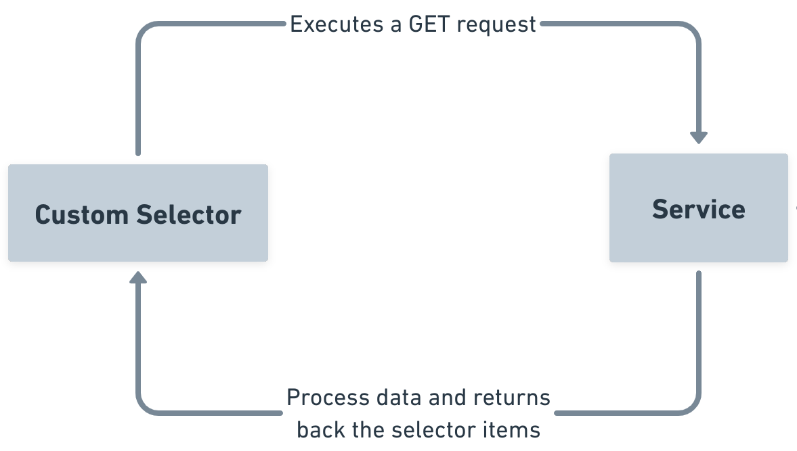
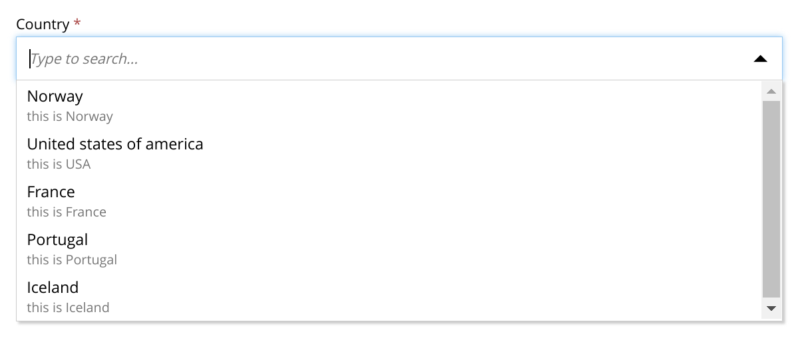
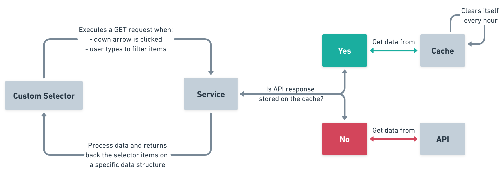
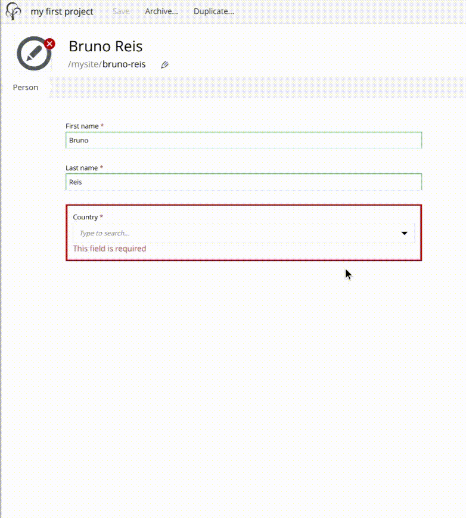
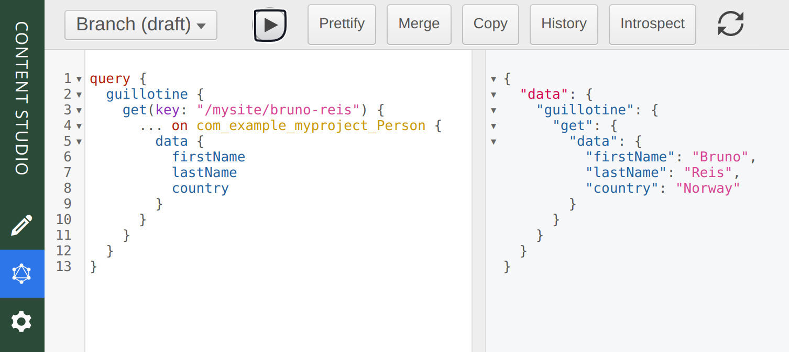
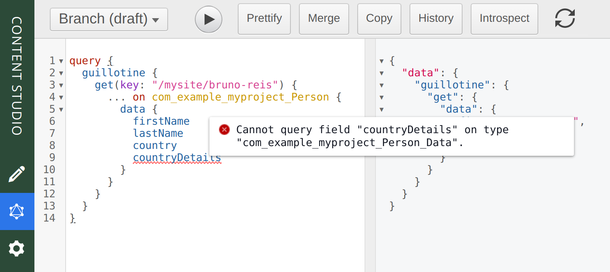
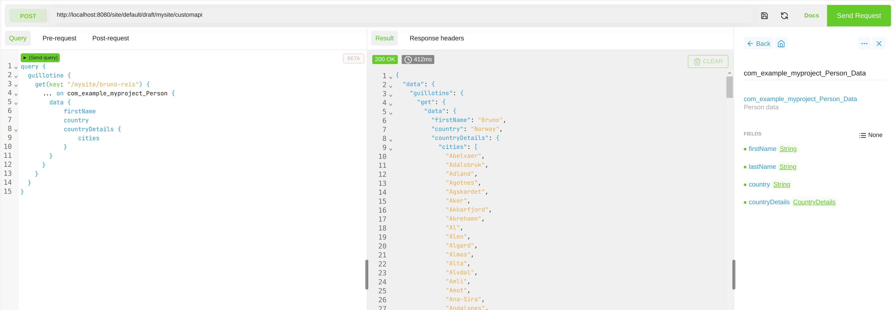

= Build a Custom Selector

****
This guide will lead you through the required steps to build an input of type *Custom Selector*.
****

== What is a custom selector
Custom selector is a specific input type that get its items from a service.

The image above is an example of a custom selector that uses an API to populate the items to be selected.

The flow of execution is really simple, and is described by the following diagram:

To read more about the details of a custom selector, visit its https://developer.enonic.com/docs/xp/stable/cms/input-types#customselector[documentation].

== Strategy

Our goal in this tutorial will be to implement a custom selector that lists all countries in the world, and then use this custom selector in a new content type.

In order to do that we will:

* Create a service that returns the list of all countries in the world
* Create a new content type and add a custom selector input type that uses that service
* Use an API to retrieve the data of all countries in the world
* Use https://market.enonic.com/vendors/enonic/http-client-lib[lib http client] to consume that API and https://market.enonic.com/vendors/enonic/http-client-lib[lib cache] to avoid unecessary calls to the API

== Create a service

Let's start our work by creating a service.

. In order to do that create a folder `countries` inside `src/main/resources/services` and then create a `countries.js` inside the `countries` folder.

. Place the following code in `countries.js`
+
[source,Javascript]
----
exports.get = function (request) {
    return { 
        status: 200, 
        body: JSON.stringify({
            hits: [
                {
                    id: 'norway',
                    displayName: 'Norway',
                    description: 'this is Norway'
                },
                {
                    id: 'usa',
                    displayName: 'United states of america',
                    description: 'this is USA'
                },
                {
                    id: 'france',
                    displayName: 'France',
                    description: 'this is France'
                },
                {
                    id: 'portugal',
                    displayName: 'Portugal',
                    description: 'this is Portugal'
                },
                {
                    id: 'iceland',
                    displayName: 'Iceland',
                    description: 'this is Iceland'
                }
            ],
            count: 5,
            total: 5
        }),
        contentType: 'application/json' 
    };
 }
----
+
This service basically returns a hardcoded data structure with some country items. We'll of course improve this service later, but for now this is enough to get our understanding on how the service will provide data to our custom selector.

== Create a content type

Now that we have our simple countries service, let's use it in a specific content type.

[start=3]
. Create a folder named `person` inside the `site/content-types` folder of your project.
. In that folder create a configuration schema named `person.xml` for the new content type.
+
[source,XML]
----
include::../src/main/resources/site/content-types/person/person.xml[]
----
. Now let's test it out... you should get a selector with the items that you defined in the previously created `countries` service:
+

NOTE: You can also refer to a service file in another application (for example, `com.myapplication.app:myservice`) instead of adding one to your application.

[source,XML]
 <config>
    <service>com.myapplication.app:my-custom-selector-service</service>
 </config>

== Request / Response format

Before we start properly coding our service, let's understand how our custom selector and our service interacts with each other.

Custom selector will request data from our service from a HTTP get request with some query params:

ids::
Array of item ids already selected in the CustomSelector. The service is expected to return the items with the specified ids.

start::
Index of the first item expected. Used for pagination of the results.

count::
Maximum number of items expected. Used for pagination of the results.

query::
String with the search text typed by the user in the CustomSelector input field.

[CAUTION]
It is the developer responsability to properly use those params in its favor to come up with performant and complex logic in order to retrieve the items from the service. For instance, pagination can be achieved based on `start` and `count` paramaters.

On the other hand, our service needs to return a specific JSON data structre in order to be able to communicate with our custom selector:

hits::
Array of item objects

count::
Number of items in response

total::
Total number of items

`hits` is an object containing array of items that will be listed in the selector's dropdown. Format of the object is described below:

id::
Unique Id of the option

displayName::
Option title

description:: (_optional_)
Detailed description

iconUrl:: (_optional_)
Path to the thumbnail image file

icon:: (_optional_)
Inline image content (for example, SVG)

.Sample JSON response:
[source,JSON]
{
  "hits": [
    {
      "id": 1,
      "displayName": "Option number 1",
      "description": "External SVG file is used as icon",
      "iconUrl": "\/admin\/portal\/edit\/draft\/_\/asset\/com.enonic.app.features:1524061998\/images\/number_1.svg"
    },
    {
      "id": 2,
      "displayName": "Option number 2",
      "description": "Inline SVG markup is used as icon",
      "icon": {
        "data": "<svg version=\"1.1\" xmlns=\"http:\/\/www.w3.org\/2000\/svg\" width=\"32\" height=\"32\" viewBox=\"0 0 32 32\"><path fill=\"#000\" d=\"M16 3c-7.18 0-13 5.82-13 13s5.82 13 13 13 13-5.82 13-13-5.82-13-13-13zM16 27c-6.075 0-11-4.925-11-11s4.925-11 11-11 11 4.925 11 11-4.925 11-11 11zM17.564 17.777c0.607-0.556 1.027-0.982 1.26-1.278 0.351-0.447 0.607-0.875 0.77-1.282 0.161-0.408 0.242-0.838 0.242-1.289 0-0.793-0.283-1.457-0.848-1.99s-1.342-0.8-2.331-0.8c-0.902 0-1.654 0.23-2.256 0.69s-0.96 1.218-1.073 2.275l1.914 0.191c0.036-0.56 0.173-0.96 0.41-1.201s0.555-0.361 0.956-0.361c0.405 0 0.723 0.115 0.952 0.345 0.23 0.23 0.346 0.56 0.346 0.988 0 0.387-0.133 0.779-0.396 1.176-0.195 0.287-0.727 0.834-1.592 1.64-1.076 0.998-1.796 1.799-2.16 2.403s-0.584 1.242-0.656 1.917h6.734v-1.781h-3.819c0.101-0.173 0.231-0.351 0.394-0.534 0.16-0.183 0.545-0.552 1.153-1.109z\"><\/path><\/svg>",
        "type": "image\/svg+xml"
      }
    }
  ],
  "count": 2,
  "total": 2
}

In this las example we're using the optional `icon` and `iconUrl` to provide icons to the items.

== Integration with CountriesNow API

Our goal now is to improve our current `countries` service. We'll do that by:

* Consuming an https://countriesnow.space/api/v0.1/countries/iso[API endpoint] that will retrieve the list of all countries in the world
* Use cache to avoid unecessary requests to that API
* Filter items based on `query` parameter in the GET request that comes from our custom selector.
* Format that data to the proper data structure seen in the previous section

[start=6]
. Start by installing the necessary dependencies:
+
[source,Gradle]
    include 'com.enonic.lib:lib-http-client:3.2.1'
    include 'com.enonic.lib:lib-cache:2.2.0'

. Then replace `countries.js` service controller with the updated version of it:
+
[source,Javascript]
----
include::../src/main/resources/services/countries/countries.js[]
----

Here are some notes on this new service controller code:

* `requestApiData` will get consume the API and store the returned JSON on cache.

* `processApiResponse` is a pure function that will get the response from the API and return a specific data structure that is the one expected from our custom selector when it is consuming our service.

* It is important to make sure that our service, on success, will always returns that data structure, otherwise our custom selector will not work.

* In this example we've opted to only use the `query` parameter that comes from the GET request triggered by our custom selector

* If we have a response from the API stored on the cache, we’ll get it, process based on the provided query param and return the json as a response. 

* If we don’t have it stored on the cache, we’ll get it from the API, and then do the same thing.

Here's a diagram that summarizes the flow between our custom selector, service, API and cache:

And this is the final result:

== Customizing with Guilliotine Lib (optional)

This is an optional part of the tutorial, and demonstrates how you may extend the GraphQL API to include additional info from the CountriesNow API.

=== Strategy

Our goal will be to come up with a custom API endpoint (using Guillotine library), in which we'll extend the data we have under our Person content type. This guillotine extension will provide the list of all cities of the selected country that used our previously created custom selector.

This may be beneficial, as your front-end will be able to avoid direct integrations with the API.

=== Setting up a custom API

Lets get the new API endpoint setup first:

[start=8]
. Add the following line to the dependencies{…​} section of your build file:
+
.build.gradle
[source,Gradle]
----
    include "com.enonic.lib:lib-guillotine:6.0.5"
----

. Add a controller to your project:
+
.resources/controllers/customapi.js
[source,Javascript]
----
  const guillotineLib = require('/lib/guillotine');
  const graphQlLib = require('/lib/graphql');

  var schema = guillotineLib.createSchema();

  exports.post = function (req) {
    const body = JSON.parse(req.body);
    const result = graphQlLib.execute(schema, body.query, body.variables);
    return {
        contentType: 'application/json',
        body: JSON.stringify(result)
    };
  };
----

. Finally, update `site.xml` with a mapping to expose the controller as an endpoint
+
.resources/site/site.xml
[source,XML]
----
  <mappings>
    <mapping controller="/controllers/customapi.js" order="50">
      <pattern>/customapi</pattern>
    </mapping>
  </mappings>
----

After deploying the code, we should be able to access our endpoint. If for instance you used the hmdb-app as your project, the API will now be available here:

    http://localhost:8080/site/hmdb/draft/hmdb/myapi

Visiting with your browser should give a 405 error, as GraphQL uses the HTTP POST method.

NOTE: Your controller can also implement a GET handler if desired. 

=== Adding a new Type

With the custom API deployed, we can now extend it with a new GraphQL type, that will represent our country details, in which we'll include all cities of the selected country.

In order to customize the API, you can use https://developer.enonic.com/docs/guillotine/stable/embed/extending[creationCallbacks].

NOTE: The full controller code is available at the end of this section

[start=11]
. This is how you can define the type of the data you'll extend>

[source,Javascript]
----
const context = guillotineLib.createContext();

context.types.countryDetails = context.schemaGenerator.createObjectType({
    name: 'CountryDetails',
    fields: {
        country: {
            type: graphQlLib.GraphQLString,
        },
        cities: {
            type: graphQlLib.list(graphQlLib.GraphQLString),
        }
    }
});
----

=== Extending 

[start=12]
. Once the new type is registered you may use it in the `creationCallbacks`:

[source,Javascript]
----
context.options.creationCallbacks = {
    'com_example_myproject_Person_Data': (ctx, params) => {
        params.fields.countryDetails = {
            type: context.types.countryDetails,
            resolve: (env) => {
                const countryName = env.source.country || '';

                if (!countryName) {
                    return {};
                }

                return {
                    country: countryName,
                    cities: requestApiData(countryName)
                }
            }
        };
    },
};
----

NOTE: The `com_example_myproject_Person_Data` must match the GraphQL type you want to override.

[start=13]
. The final trick is to create the GraphQL schema. https://developer.enonic.com/docs/guillotine/stable/embed/extending[More details on extending schemas].

[source,Javascript]
----
function createSchema() {
    return context.schemaGenerator.createSchema({
        query: createRootQueryType(context),
        dictionary: context.dictionary
    });
}
----

=== Final controller code

[start=14]
. Try it all in your project by replacing your existing customapi controller with the following code:

.resources/controllers/customapi.js
[source,Javascript]
----
include::../src/main/resources/controllers/customapi.js[]
----

=== Manual testing

Let's finally consume our custom endpoint to check if everything is working as expected.

In this case we've ran the following query:
----
query {
  guillotine {
    get(key: "/mysite/bruno-reis") {
      ... on com_example_myproject_Person {
        data {
            firstName
            lastName
            country
        }
      }
    }
  }
}
----
in content studio query playground just to demonstrate the return of the data. 

NOTE: If you don't see `Query playground` in the Content Studio menu, it has probably not been installed yet. Simply install the https://market.enonic.com/vendors/enonic/guillotine[Guillotine application], and it will appear.

Queries executed on query playground will run in an endpoint that is different from the custom one we created, and therefore there is will be no `countryDetails` field in Person's content type data field:

Now let's execute a POST request to our custom endpoint, requesting not only the fields from our content type, but also the field we extended:

----
query {
  guillotine {
    get(key: "/mysite/bruno-reis") {
      ... on com_example_myproject_Person {
        data {
            firstName
            country
            countryDetails {
                cities
            }
        }
      }
    }
  }
}
----

and here's our response

In this last image we've used chrome's extension Altair GraphQL Client to ran the query in a different url and  better visualize the results.

TIP: Need help? Ask questions on our https://discuss.enonic.com/[forum] visit our https://slack.enonic.com[community Slack].