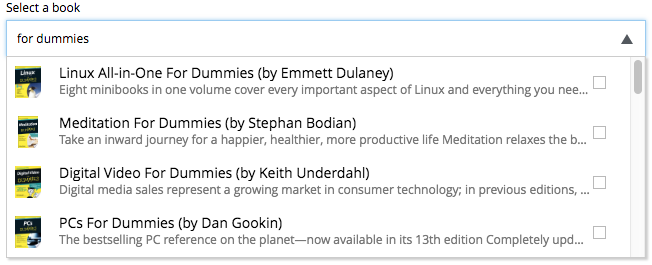

= Build a Custom Selector

****
This guide will lead you through the required steps to build an input of type *Custom Selector*.
****

== Create a content type

. Create a folder called `my-custom-selector` inside the `site/content-types` folder of your project.
. In that folder create a configuration schema called `my-custom-selector.xml` for the new content type.

+
[source,XML]
----
include::../src/main/resources/site/content-types/my-custom-selector/my-custom-selector.xml[]
----
+

== Create a service

[start=3]
. Create a folder called `my-custom-selector-service` (folder name must match the one specified in the config schema) inside the `resources/services` folder of your project.
. In that folder create a javascript service file called `my-custom-selector-service.js` (again, the name must match the config schema).
. Create *GET* handler method in this service file and make sure it returns JSON in proper format.

+
[source,Javascript]
----
include::../src/main/resources/services/my-custom-selector-service/my-custom-selector-service.js[]
----
+

[CAUTION]
You have to manually handle paging of items in your service based on `start` and `count` parameters of the *GET* request sent to the service.

NOTE: You can also refer to service file in another application (for example, `com.myapplication.app:myservice`) instead of adding one to your application.

::
[source,XML]
 <config>
    <service>com.myapplication.app:my-custom-selector-service</service>
 </config>

== Response format

JSON response object must contain three properties:

hits::
Array of item objects

count::
Number of items in response

total::
Total number of items

`hits` is an object containing array of items that will be listed in the selector's dropdown. Format of the object is described below:

id::
Unique Id of the option

displayName::
Option title

description:: (_optional_)
Detailed description

iconUrl:: (_optional_)
Path to the thumbnail image file

icon:: (_optional_)
Inline image content (for example, SVG)

.Sample JSON response:
[source,JSON]
{
  "hits": [
    {
      "id": 1,
      "displayName": "Option number 1",
      "description": "External SVG file is used as icon",
      "iconUrl": "\/admin\/portal\/edit\/draft\/_\/asset\/com.enonic.app.features:1524061998\/images\/number_1.svg"
    },
    {
      "id": 2,
      "displayName": "Option number 2",
      "description": "Inline SVG markup is used as icon",
      "icon": {
        "data": "<svg version=\"1.1\" xmlns=\"http:\/\/www.w3.org\/2000\/svg\" width=\"32\" height=\"32\" viewBox=\"0 0 32 32\"><path fill=\"#000\" d=\"M16 3c-7.18 0-13 5.82-13 13s5.82 13 13 13 13-5.82 13-13-5.82-13-13-13zM16 27c-6.075 0-11-4.925-11-11s4.925-11 11-11 11 4.925 11 11-4.925 11-11 11zM17.564 17.777c0.607-0.556 1.027-0.982 1.26-1.278 0.351-0.447 0.607-0.875 0.77-1.282 0.161-0.408 0.242-0.838 0.242-1.289 0-0.793-0.283-1.457-0.848-1.99s-1.342-0.8-2.331-0.8c-0.902 0-1.654 0.23-2.256 0.69s-0.96 1.218-1.073 2.275l1.914 0.191c0.036-0.56 0.173-0.96 0.41-1.201s0.555-0.361 0.956-0.361c0.405 0 0.723 0.115 0.952 0.345 0.23 0.23 0.346 0.56 0.346 0.988 0 0.387-0.133 0.779-0.396 1.176-0.195 0.287-0.727 0.834-1.592 1.64-1.076 0.998-1.796 1.799-2.16 2.403s-0.584 1.242-0.656 1.917h6.734v-1.781h-3.819c0.101-0.173 0.231-0.351 0.394-0.534 0.16-0.183 0.545-0.552 1.153-1.109z\"><\/path><\/svg>",
        "type": "image\/svg+xml"
      }
    }
  ],
  "count": 2,
  "total": 2
}

== Integration with Google Books API

And here's a bit more advanced version of the service file that fetches book titles from the *Google Books API*:

[source,Javascript]
----
include::../src/main/resources/services/books-service/books-service.js[]
----

