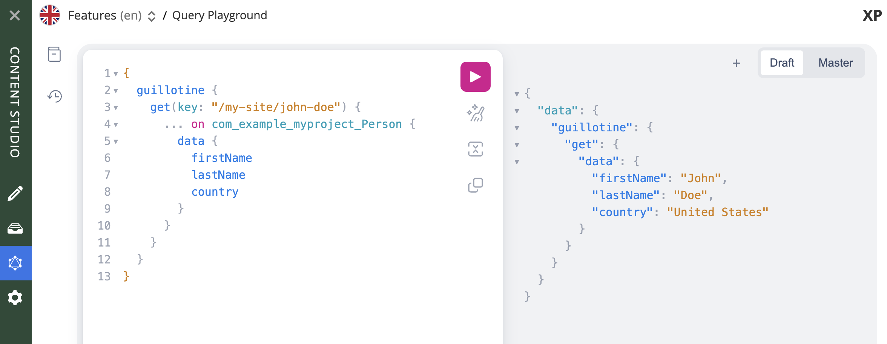

= Build a Custom Selector

****
This guide will lead you through the required steps to build an input of type *Custom Selector*.
****

== What is a Custom Selector
Custom Selector is a specific type of selector that gets its dataset from a service.

image:images/custom-selector-books.png["Custom selector", width=100%, align="center"]

The image above is an example of a Custom Selector that uses an external API to populate the items to be selected.

The flow of execution is really simple and described by the following diagram:

To read more about specifics of the CustomSelector input type, visit its https://developer.enonic.com/docs/xp/stable/cms/schemas/input-types/customselector[documentation].

== Implementation

NOTE: This tutorial assumes that you have a basic understanding of Enonic XP concepts, such as applications, content types, and services. It also assumes that you have an existing XP project to add a Custom Selector to. If you are new to Enonic XP, we recommend that you first read the https://developer.enonic.com/docs/intro/stable[Introduction to Enonic]. If you don't have an existing application, we recommend you check out the <<index#_tldr, TLDR section>> in the end of this tutorial.

Our goal in this tutorial will be to implement a Custom Selector that lists all countries in the world, and then use it in a new content type.

In order to do that we will:

* Create a service that returns the list of all countries in the world.
* Create a Custom Selector input type which uses this service
* Create a new content type which contains this Custom Selector
* Our service will fetch data from an external API. We will use https://market.enonic.com/vendors/enonic/http-client-lib[lib http client] to consume that API and https://market.enonic.com/vendors/enonic/http-client-lib[lib cache] to avoid unnecessary calls to the API

=== Create a service

Let's start our work by creating a service.

. In order to do that create a folder `countries` inside `src/main/resources/services` and then create a `countries.js` inside the `countries` folder.

. Place the following code in `countries.js`
+
[source,Javascript]
----
exports.get = function (request) {
    return {
        status: 200,
        body: JSON.stringify({
            hits: [
                {
                    id: 'norway',
                    displayName: 'Norway',
                    description: 'this is Norway'
                },
                {
                    id: 'usa',
                    displayName: 'United states of america',
                    description: 'this is USA'
                },
                {
                    id: 'france',
                    displayName: 'France',
                    description: 'this is France'
                },
                {
                    id: 'portugal',
                    displayName: 'Portugal',
                    description: 'this is Portugal'
                },
                {
                    id: 'iceland',
                    displayName: 'Iceland',
                    description: 'this is Iceland'
                }
            ],
            count: 5,
            total: 5
        }),
        contentType: 'application/json'
    };
 }
----
+
This service basically returns a hardcoded data structure with some country items. We'll of course improve this service later, but for now this is enough to get our understanding of how the service will provide data to our Custom Selector.

=== Create a content type

Now that we have our simple countries service, let's use it in a specific content type.

. Create a folder named `person` inside the `site/content-types` folder of your project.
. In that folder create a configuration schema named `person.xml` for the new content type.
+
[source,XML]
----
include::../src/main/resources/site/content-types/person/person.xml[]
----

Now let's test it out...

. Create a site in Content Studio

. Assign the application that contains the 'Person' content type to the site and Save

. Inside the site create a new content of type 'Person'

. Inside the content edit form you should see a selector with the items that you defined in the previously created `countries` service:
+
image:images/custom-selector-hardcoded-service.png["Custom selector exaple 1", width=100%, align="center"]

NOTE: You can also refer to a service file in another application (for example, `com.myapplication.app:myservice`) instead of adding one to your application.

[source,XML]
 <config>
    <service>com.myapplication.app:my-custom-selector-service</service>
 </config>

=== Request / Response format

Before we start properly coding our service, let's understand how our Custom Selector and our service interact with each other.

Custom Selector will request data from the service from a HTTP GET request with some query params:

ids::
Array of item ids already selected in the Custom Selector. The service is expected to return the items with the specified ids.

start::
Index of the first item expected. Used for pagination of the results.

count::
Maximum number of items expected. Used for pagination of the results.

query::
String with the search text typed by the user in the CustomSelector input field.

[CAUTION]
It is the developer's responsibility to properly use those params to ensure performant and complex logic in order to retrieve the items from the service. For instance, pagination can be achieved based on `start` and `count` parameters.

On the other hand, our service needs to return a specific JSON data structure in order to be able to communicate with our Custom Selector:

.Sample JSON response:
[source,JSON]
----
{
  "hits": [ // <1>
    {
      "id": 1, // <2>
      "displayName": "Option number 1", // <3>
      "description": "External SVG file is used as icon", // <4>
      "iconUrl": "\/admin\/portal\/edit\/draft\/_\/asset\/com.enonic.app.features:1524061998\/images\/number_1.svg" // <5>
    },
    {
      "id": 2,
      "displayName": "Option number 2",
      "description": "Inline SVG markup is used as icon",
      "icon": { // <6>
        "data": "<svg version=\"1.1\" xmlns=\"http:\/\/www.w3.org\/2000\/svg\" width=\"32\" height=\"32\" viewBox=\"0 0 32 32\"><path fill=\"#000\" d=\"M16 3c-7.18 0-13 5.82-13 13s5.82 13 13 13 13-5.82 13-13-5.82-13-13-13zM16 27c-6.075 0-11-4.925-11-11s4.925-11 11-11 11 4.925 11 11-4.925 11-11 11zM17.564 17.777c0.607-0.556 1.027-0.982 1.26-1.278 0.351-0.447 0.607-0.875 0.77-1.282 0.161-0.408 0.242-0.838 0.242-1.289 0-0.793-0.283-1.457-0.848-1.99s-1.342-0.8-2.331-0.8c-0.902 0-1.654 0.23-2.256 0.69s-0.96 1.218-1.073 2.275l1.914 0.191c0.036-0.56 0.173-0.96 0.41-1.201s0.555-0.361 0.956-0.361c0.405 0 0.723 0.115 0.952 0.345 0.23 0.23 0.346 0.56 0.346 0.988 0 0.387-0.133 0.779-0.396 1.176-0.195 0.287-0.727 0.834-1.592 1.64-1.076 0.998-1.796 1.799-2.16 2.403s-0.584 1.242-0.656 1.917h6.734v-1.781h-3.819c0.101-0.173 0.231-0.351 0.394-0.534 0.16-0.183 0.545-0.552 1.153-1.109z\"><\/path><\/svg>",
        "type": "image\/svg+xml"
      }
    }
  ],
  "count": 2, // <7>
  "total": 2 // <8>
}
----

<1> Array of item objects
<2> Unique Id of the option
<3> Option title
<4> Detailed description
<5> Path to the thumbnail image file
<6> Inline image content (for example, SVG)
<7> Number of items in response
<8> Total number of items

`hits` is an object containing array of items that will be listed in the selector's dropdown. In this last example we're using the optional `icon` and `iconUrl` to provide icons for the items in the response.

=== Integration with CountriesNow API

Our goal now is to improve our current `countries` service. We'll do that by:

* Consuming an https://countriesnow.space/api/v0.1/countries/iso[API endpoint] that will retrieve the list of all countries in the world
* Use cache to avoid unnecessary requests to this API
* Filter items based on `query` parameter in the GET request that comes from our custom selector.
* Format data to ensure proper data structure seen in the previous section

. Start by installing the necessary dependencies:
+
[source,Gradle]
    include 'com.enonic.lib:lib-http-client:3.2.2'
    include 'com.enonic.lib:lib-cache:2.2.0'

. Then replace `countries.js` service controller with the updated version of it:
+
[source,Javascript]
----
include::../src/main/resources/services/countries/countries.js[]
----

Here are some notes on this new service controller code:

* `fetchCountryList` will consume the API to fetch the list of all countries and store the returned JSON on cache.

* `fetchCityList` will do the same for fetching the list of all cities of a specific country. This will be used later on in the tutorial.

* `processApiResponse` is a function that processes response from `fetchCountryList` and returns a specific data structure expected by Custom Selector when it consumes our service.

IMPORTANT: It is important to make sure that our service always returns data in this specific format, otherwise our Custom Selector will not work.

* In this example we've opted to only use the `query` parameter that comes from the GET request triggered by our Custom Selector

* If we have a response from the API already stored in the cache, we’ll retrieve it, process it based on the provided query param and return the JSON as a response, skipping the API call.

* If we don’t have it stored on the cache, we’ll get it from the API, and then store it in the cache.

Here's a diagram that summarizes the flow between our custom selector, service, API and cache:

And this is the final result:

image:images/result.gif["Custom selector example 2", width=100%, align="center"]

== Integration with GraphQL API (optional)

NOTE: This is an optional part of the tutorial, and demonstrates how you may extend the GraphQL API to include additional info from the CountriesNow API.

The Headless API provides access to all the content within your project. It is based on the https://graphql.org/[GraphQL] query language, which is a powerful and flexible way to interact with your data.

TIP: Want to know more about GraphQL in general? Visit the https://graphql.org[official GraphQL documentation^].

In Enonic XP the Headless API is provided by the Guillotine application. If you have followed our TLDR guide, you should already have Guillotine installed in your XP instance. If not, install it from the https://market.enonic.com/vendors/enonic/guillotine[Enonic Market].

Click the GraphQL icon in the Content Studio's left hand menu to open `Query Playground`. Here you may test and play with the GraphQL API directly.

=== GraphQL schema

Once installed, Guillotine provides a default schema that includes all the content types and their fields. This schema is automatically generated based on the content types you have in your project.

Let's say you have created a site called `my-site` and a person (content of `Person` content type) in that site called "John Doe".

You can query it from the Query Playground using the following GraphQL query:

----
{
  guillotine {
    get(key: "/my-site/john-doe") {
      ... on com_example_myproject_Person {
        data {
          firstName
          lastName
          country
        }
      }
    }
  }
}
----

=== Schema extension

But what if we want to add fields to the response which are not a part of the content type? For example, we want to add a `countryDetails` field to the `Person` content type, which will include the country's name and a list of its cities.

Extending a Guillotine schema can easily be done by adding a file called `guillotine.js` to the `src/main/resources/guillotine` folder of your project. This file should contain a special `exports.extensions` function which implements new types, new fields and resolvers of the field values.

TIP: Need help extending your Guillotine schema? Find more details in the https://developer.enonic.com/docs/guillotine/stable/extending[official documentation].

Here's an example of how to extend the `Person` content type with a `countryDetails` field containing the country's name and a list of its cities:
[source,Javascript]
----
include::../src/main/resources/guillotine/guillotine.js[]
----

Assuming we still have our "John Doe" person with a country selected, let's add the new fields to our GraphQL query in the Query Playground:

----
{
  guillotine {
    get(key: "/my-site/john-doe") {
      ... on com_example_myproject_Person {
        data {
          firstName
          lastName
          country
          countryDetails {
            country
            cities
          }
        }
      }
    }
  }
}
----

and here's our response:

TIP: Need help? Ask questions on our https://discuss.enonic.com/[forum] visit our https://slack.enonic.com[community Slack].

== TLDR;

If you want to skip the implementation details and just see the final result, you can download the source code of the project using https://developer.enonic.com/docs/enonic-cli[Enonic CLI].

. Create a new project using Enonic CLI based on the `guide-custom-selector` starter:

[source,sh]
enonic create com.example.myproject -r guide-custom-selector

TIP: If you already have a sandbox, you can instantly link the new project to it by providing `-s` parameter:

[source,sh]
enonic create com.example.myproject -r guide-custom-selector -s <sandbox-name>

[start=2]
. If you don't have a sandbox yet, answer "*Yes*" when asked if you want to create a sandbox for the project, and select `Essentials` when asked about the sandbox template. This will install *Content Studio* and *Guillotine* applications, needed for this tutorial.

. Give the new sandbox any name and agree to using the latest version of Enonic XP.

. Go inside the project folder and deploy it to your Enonic XP instance:
[source,sh]
cd myproject
enonic project deploy

. Open http://localhost:8080 in your browser (or just click the link).

. Log in as Guest and open Content Studio

. Create a new site, assign the application called "Guide to custom selector" to the site and Save.

. Create one or several content items of type "Person" inside the site. You should see a Custom Selector with the list of countries inside the dropdown.

. Use the Query Playground (GraphQL icon in the menu on the left) to query the person's country details, including the country's name and a list of its cities.
